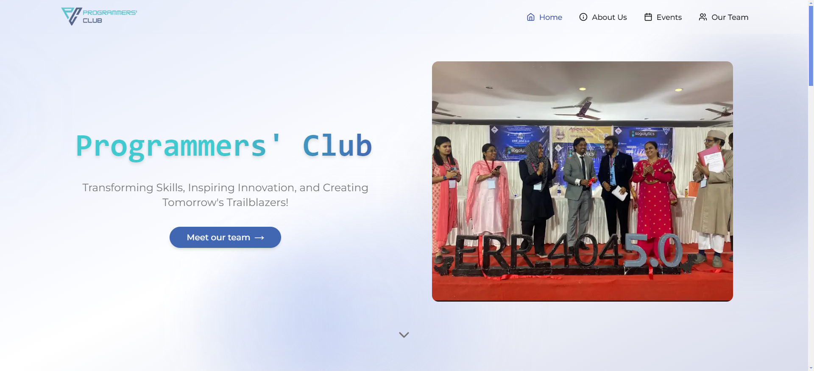

# Programmers Club 🚀

A sleek and responsive landing page built with Next.js 14, featuring dynamic sections and smooth scrolling effects.

## 🖥️ Live Preview



> 💡 Live demo: [View Demo](https://programmersclub.vercel.app/)

## ✨ Features

- 🎨 Modern, responsive design
- 📱 Smart navbar with scroll detection
- 🌈 Custom background effects
- 📑 Multiple content sections (Hero, About, Events, Team)
- 🔧 Built with TypeScript for type safety
- 🎭 Smooth animations and transitions
- 📱 Mobile-first approach
- 🔍 SEO optimized
- 🚀 Fast page loads
- 🌐 Cross-browser compatible

## 🛠️ Tech Stack

- Next.js 14
- React
- TypeScript
- CSS Modules
- Framer Motion (for animations)
- ESLint (code quality)
- Prettier (code formatting)
- Vercel (deployment)

## 🎨 Design Features

- Minimalist and clean UI
- Custom color palette
- Responsive typography
- Modern card designs
- Interactive hover effects
- Smooth scroll behavior

## 🚀 Getting Started

1. **Clone the repository**
   ```bash
   git clone https://github.com/HumayunK01/programmersclub.git
   ```

2. **Install dependencies**
   ```bash
   npm install
   ```

3. **Run the development server**
   ```bash
   npm run dev
   ```

4. Open [http://localhost:3000](http://localhost:3000) to view the site

## 📁 Components Overview

- **Navbar**: Responsive navigation with scroll-based styling
- **Background**: Wrapper component for visual effects
- **Sections**:
  - Hero: Main landing section
  - About: Project/company information
  - Events: Events showcase
  - Team: Team members display
- **Footer**: Site footer with links

## 💡 Usage Tips

- Use the navigation menu to jump to different sections
- Explore hover effects on interactive elements
- Check out the responsive design on different devices
- Experience smooth scrolling animations

## 🤝 Contributing

Contributions are welcome! Please feel free to submit a Pull Request.

## 📝 License

Copyright © 2024 [Humayun Khan](https://devhumayun.vercel.app/). <br />
This project is licensed under the MIT License.

## 📧 Contact

Your Name - [humayunk.pvt@gmail.com](mailto:humayunk.pvt@gmail.com)

**[⬆ back to top](#programmers-club-)**